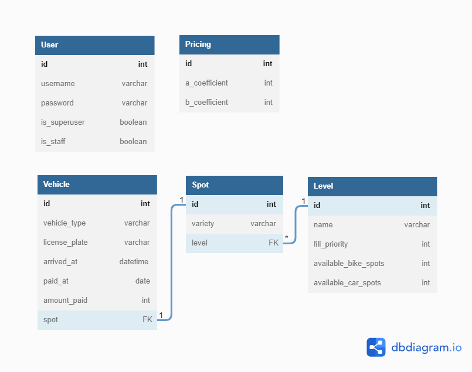

Parking Lot
========

Esse é um projeto que gerencia um estacionamento de veículos. Por questões de simplificação, existem apenas vagas para carros e motos.

Existe uma regra de negócios, onde cada nível do estacionamento possui uma prioridade de preenchimento, onde o nível de maior prioridade deve ser preenchido primeiro.


* * *
Como rodar a aplicação?
--------

1. Crie um arquivo .env na raiz da aplicação seguindo o exemplo contido no arquivo .env.example.
2. Caso tenha o Docker instalado, execute o comando docker compose up ou docker-compose up dependendo da versão do docker-compose que esteja instalada em sua máquina.


* * *

Diagrama Entidade/Relacionamento
--------------------------------




* * *

Sobre Usuários (`User`):
------------------------

- O único usuário da aplicação é o admin.

## `POST /api/accounts/` - criando um admin

```
// REQUEST
{
  "username": "admin",
  "password": "1234",
  "is_superuser": true,
  "is_staff": true
}
```

```
// RESPONSE STATUS -> HTTP 201
{
  "id": 1,
  "is_superuser": true,
  "is_staff": true,
  "username": "admin"
```

## `POST /api/login/` - obtendo um token para o usuário

```
// REQUEST
{
  "username": "admin",
  "password": "1234"
}
```

```
// REQUEST STATUS -> HTTP 200
{
  "token": "0f500a8c2f2f8d5e77ad86b3a8d373a0528d8812"
}
```

* * *

Sobre Níveis (`Level`)
-------------------

- Níveis representam um andar dentro de um estacionamento.
- As informações para criação de um nível devem especificar a quantidade de vagas para cada tipo de veículo (carro e moto).
- As informações para criação de um nível devem especificar uma fill_priority, ou seja, uma prioridade de preenchimento. Este valor será utilizado nas regras de negócio, para que o sistema consiga definir qual a próxima vaga a ser preenchida.

## `POST /api/levels/` - criando um novo nível
```
// REQUEST 
// Header -> Authorization: Token <token-do-admin>
{
  "name": "floor 1",
  "fill_priority": 2,
  "bike_spots": 1,
  "car_spots": 2
}
```

```
// RESPONSE STATUS -> HTTP 201
{
  "id": 1,
  "name": "floor 1",
  "fill_priority": 2,
  "available_spots": {
    "available_bike_spots": 1,
    "available_car_spots": 2
  }
}
```

## `GET /api/levels/` - listando os níveis

```
// RESPONSE STATUS -> HTTP 200
[
  {
    "id": 1,
    "name": "floor 1",
    "fill_priority": 5,
    "available_spots": {
      "available_bike_spots": 20,
      "available_car_spots": 50
    }
  },
  {
    "id": 2,
    "name": "floor 2",
    "fill_priority": 3,
    "available_spots": {
      "available_bike_spots": 10,
      "available_car_spots": 30
    }
  }
]
```

* * *

Sobre Preços (`Pricing`)
--------------------------

- Para cálculo do valor a ser pago para cada veículo será utilizada a seguinte equação:

$$V(t) = a + b.t$$

Onde:
- `a` - representa o coeficiente linear
- `b` - o coeficiente angular da equação.
- `t` - o número de horas que o veículo permaneceu no estacionamento
- `V` - é o valor a ser pago (em centavos)

## `POST /api/pricings/` - criando uma nova precificação:

```
// REQUEST 
// Header -> Authorization: Token <token-do-admin>
{
  "a_coefficient": 100,
  "b_coefficient": 100
}
```
```
// RESPONSE STATUS -> HTTP 201
{
  "id": 1,
  "a_coefficient": 100,
  "b_coefficient": 100
}
```
- No momento de determinar o valor a ser pago para cada veículo, o sistema deve utilizar a última precificação inserida para fazer o cálculo.
- Se não houver nenhuma precificação salva no sistema, o sistema não poderá criar registros de entrada no estacionamento. Nesse caso deve ser devolvida uma resposta com código `HTTP 404`.

* * *

Sobre Veículos (`Vehicle`)
------------------------------------------
## `POST /api/vehicles/` - criando um novo registro de entrada:

```
// REQUEST
{
  "vehicle_type": "car",
  "license_plate": "AYO1029"
}
```

```
// RESPONSE STATUS -> HTTP 201
{
  "id": 1,
  "license_plate": "AYO1029",
  "vehicle_type": "car",
  "arrived_at": "2021-01-25T17:16:25.727541Z",
  "paid_at": null,
  "amount_paid": null,
  "spot": {
    "id": 2,
    "variety": "car",
    "level_name": "floor 1"
  }
}
```
- No momento da criação do registro de entrada, deve ser atribuída uma vaga de acordo com o tipo do veículo e a prioridade de preenchimento de cada andar. O sistema deverá escolher uma vaga qualquer do andar que tiver o maior valor de fill_priority. Se houver 2 ou mais níveis com o mesmo valor de fill_priority, o sistema terá liberdade para optar por qualquer um deles.
- Se não houver nenhum nível ao cadastrar um registro de entrada, o sistema não poderá criar o registro de entrada no estacionamento. Nesse caso deve ser devolvida uma resposta com código `HTTP 404`.
- Se não houver vagas disponiveis, o sistema não poderá criar registros de entrada no estacionamento. Nesse caso deve ser devolvida uma resposta com código `HTTP 404`.

## `PUT /api/vehicles/<int:vehicle_id>/` - registrando a saída e pagamento do veículo:

```
// REPONSE STATUS -> HTTP 200
{
  "license_plate": "AYO1029",
  "vehicle_type": "car",
  "arrived_at": "2021-01-21T19:36:55.364610Z",
  "paid_at": "2021-01-21T19:37:23.016452Z",
  "amount_paid": 100,
  "spot": null
}
```
- Para pagar o estacionamento de um determinado veículo, basta enviar um request `PUT /api/vehcles/<int:vehicle_id>/` colocando o vehicle_id como parâmetro URL.
- As informações `paid_at` e `amount_paid` são calculadas pelo próprio sistema.
- Este request ocasiona a liberação da vaga ocupada pelo veículo. Portanto, deve ser possível observar `spot: null`


* * *

Resumo dos Endpoints:
----------

URLs:
-----

| Método | Endpoint | Responsabilidade |
|--- |--- |--- |
| POST | /api/accounts/ | Criação de usuários (Não precisa de autenticação) |
| POST | /api/login/ | Faz a autenticação do usuário |
| POST | /api/levels/ | Criação de um novo nível (Somente Admin) |
| GET | /api/levels/ | Listagem dos níveis |
| GET | /api/pricings/ | Criação de uma nova precificação (Somente Admin) |
| POST | /api/vehicles/ | Criando um novo registro de entrada |
| PUT | /api/vehicles/{vehicle_id}/ | Registro de saída e pagamento do veículo |

* * *